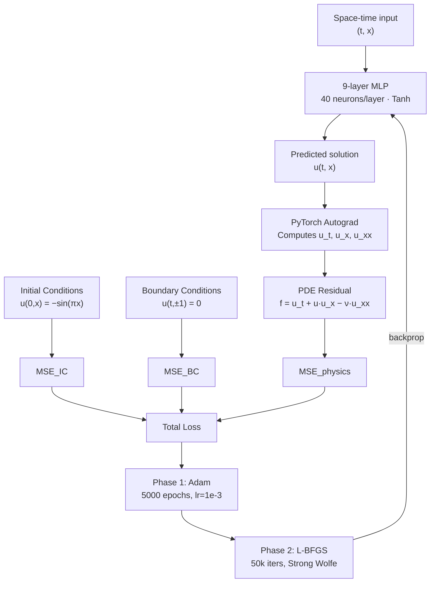
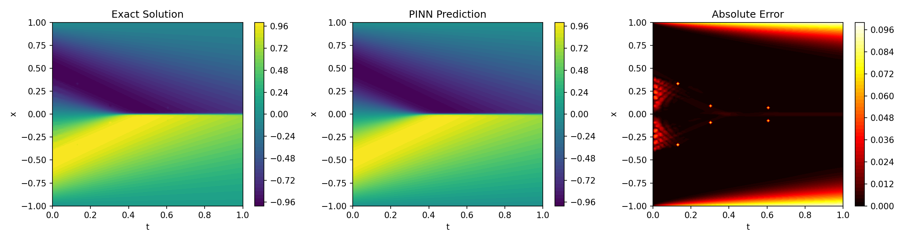

# Physics-Informed Neural Networks

Solve nonlinear PDEs with neural networks — no labeled data, just physics.


## What This Does

Physics-Informed Neural Networks (PINNs) are a class of deep learning models that learn to satisfy a partial differential equation (PDE) rather than just fit labeled data. Instead of collecting ground-truth solution values across the domain, a PINN encodes the PDE itself into the loss function using automatic differentiation — enforcing that the network's output satisfies the governing physics at every sampled point.

This repository implements two canonical PDE benchmarks to demonstrate the PINN methodology end-to-end:

- **Burgers Equation** — a nonlinear 1D PDE with viscous diffusion, validated against its exact Cole-Hopf analytical solution. The PINN achieves a final loss of **0.0006** and max absolute error of **~0.046**.
- **Schrödinger Equation** — a nonlinear, complex-valued 1D PDE requiring periodic boundary conditions and a two-output network for the real and imaginary parts. L-BFGS fine-tuning drives the final loss to **4.2 × 10⁻⁵**.

Both implementations follow the two-phase training strategy from the original PINNs paper (Raissi et al., 2019): coarse convergence with Adam followed by high-precision refinement with L-BFGS.

## Architecture



> The Schrödinger implementation outputs two values (real + imaginary parts) and enforces periodic boundary conditions as an additional loss term.

## Key Results

| Equation | Optimizer phases | Final loss | Error metric |
|---|---|---|---|
| Burgers | Adam (5k) + L-BFGS | 0.0006 | Max abs error ≈ 0.046 |
| Schrödinger | Adam (5k) + L-BFGS (6k) | 4.2 × 10⁻⁵ | MSE_IC: 6×10⁻⁶, MSE_BC: 5×10⁻⁶ |



## Quick Start

```bash
git clone https://github.com/yourusername/Physics-informed-Neural-Networks.git
cd Physics-informed-Neural-Networks
python -m venv .venv && source .venv/bin/activate   # Windows: .venv\Scripts\activate
pip install -r requirements.txt
jupyter notebook
```

Open `pinn_burgers.ipynb` or `pinn_schrodinger.ipynb` and run all cells. A GPU with CUDA 12.x is recommended but not required.

## Project Structure

```
Physics-informed-Neural-Networks/
├── pinn_burgers.ipynb        # Burgers equation PINN — full training + validation vs. exact solution
├── pinn_schrodinger.ipynb    # Schrödinger equation PINN — complex-valued PDE with periodic BCs
├── pinn_heat_equation.png    # Visualization: predicted solution, exact solution, and absolute error
├── requirements.txt          # Full pinned dependencies (CUDA 12.x, PyTorch, SciPy, etc.)
└── .python-version           # Python 3.12.8
```

## How It Works

### The Core Idea

A PINN repurposes automatic differentiation — the same mechanism that computes gradients during backprop — to evaluate the PDE residual at sampled collocation points. For the Burgers equation:

```
u_t + u·u_x − (0.01/π)·u_xx = 0
```

PyTorch computes `u_t`, `u_x`, `u_xx` by differentiating the network output with respect to its inputs. The residual `f = u_t + u·u_x − ν·u_xx` should be zero everywhere in the domain if the network has learned the true solution. This becomes a loss term.

### Loss Function

```
Total Loss = MSE(IC) + MSE(BC) + MSE(PDE residual)
```

Where:
- **MSE(IC)** — fit to known initial conditions (e.g. u(0,x) = −sin(πx))
- **MSE(BC)** — fit to boundary conditions (Dirichlet for Burgers, periodic for Schrödinger)
- **MSE(PDE residual)** — minimize the physics violation across 10k–20k collocation points

### Collocation Sampling

- **Burgers**: random uniform sampling over the domain
- **Schrödinger**: Latin Hypercube Sampling (LHS) via `scipy.stats.qmc` for more uniform coverage

### Two-Phase Training

| Phase | Optimizer | Why |
|---|---|---|
| 1 | Adam, 5000 epochs, lr=1e-3 | Fast escape from poor initialization |
| 2 | L-BFGS, 50k iters, Strong Wolfe line search | High-precision convergence near the solution |

Adam handles the rough terrain early on; L-BFGS exploits second-order curvature information for tight final convergence. This is the standard recipe from the original PINNs paper.

## Tech Stack

| Library | Role |
|---|---|
| **PyTorch** | Neural network, autograd for PDE derivatives, Adam + L-BFGS optimizers |
| **SciPy** | Latin Hypercube Sampling (`qmc`), quadrature for exact Burgers solution |
| **NumPy** | Array ops and domain grid generation |
| **Matplotlib** | Solution, error, and loss curve visualization |
| **SymPy** | Symbolic Cole-Hopf transformation for Burgers validation |

## References

- Raissi, M., Perdikaris, P., & Karniadakis, G. E. (2019). [Physics-informed neural networks: A deep learning framework for solving forward and inverse problems involving nonlinear partial differential equations.](https://www.sciencedirect.com/science/article/pii/S0021999118307125) *Journal of Computational Physics*, 378, 686–707.
- Lu, L., Meng, X., Mao, Z., & Karniadakis, G. E. (2021). [DeepXDE: A deep learning library for solving differential equations.](https://epubs.siam.org/doi/10.1137/19M1274067) *SIAM Review*, 63(1), 208–228.
- Baydin, A. G., et al. (2018). [Automatic Differentiation in Machine Learning: a Survey.](https://jmlr.org/papers/v18/17-468.html) *JMLR*, 18(153), 1–43.

## License

MIT
